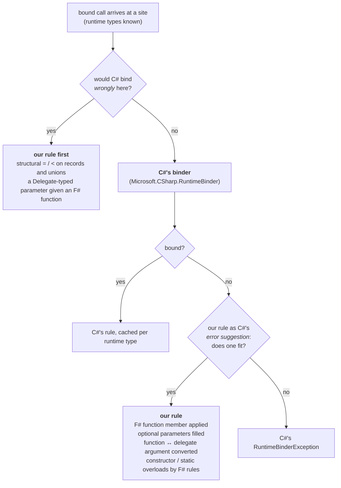

# The F#-aware binders

Where our rules sit relative to C#'s, and what each one does. Part of [internals](internals.md);
the checklist for adding one is the `new-binder` skill.

## Where a rule goes

The rule from `CLAUDE.md`, drawn once: ours goes before C#'s only where C# would bind *wrongly*
rather than fail; everywhere else it is C#'s error suggestion, so a member C# can bind is bound
exactly as C# would. Both paths produce DLR rules restricted on runtime types, so the decision is
cached per type like everything else.

## Invocation

The C# binder invokes delegates and dynamic objects; an F# function value is an `FSharpFunc`
object, which it reports as "Cannot invoke a non-delegate type". Three binders in `Binders.fs`
subclass the DLR's binder types, wrap C#'s, and add the F# case in the fallbacks:

- **`FSharpInvokeMemberBinder`** (`x?Name(args)`). `FallbackInvokeMember` (a CLR target): if the
  type has an accessible property or field of that name whose type is a fitting `FSharpFunc`
  shape and no method of that name, the rule reads and applies it; otherwise C#'s binding — with
  a rule for a method whose F# optional parameters (`?arg`, i.e. `[<OptionalArgument>]
  FSharpOption<'T>`) the arguments fit once omitted ones are `None` and bare values `Some`,
  offered as the *error suggestion*, which C# uses only where its own binding fails
  (`OptionalArguments.tryCall`). `FallbackInvoke` (a dynamic target has produced the member's
  value): delegates to `FSharpInvokeBinder`.
- **`FSharpInvokeBinder`** (`Dlr.call`, and the value step above). `FallbackInvoke`: if the value's
  runtime type is a candidate, a rule applying it restricted to that type; otherwise C#'s `Invoke`.
  A value-less meta-object (Expando's `BindInvokeMember` hands over the member before evaluating
  it) is `Defer`red, so the nested site binds through this binder with the value.
- **`FSharpReadOrInvokeBinder`** (`x?Name` read as `unit -> R`). A parameterless method is
  invoked; a property or field is read (and applied if it is an F# function); on a dynamic
  target the value itself is the result unless it is a delegate or function.

The shape is read off the *function's* type — the runtime type of a dynamic value, the declared
type of a CLR member — never off the call's declared result: `FSharpFunc<A * B, R>` (tupled) or
`FSharpFunc<A, FSharpFunc<B, R>>` (curried) whose domains the argument types fit. The rule is
built for any arity: a tuple construction and one `Invoke` for tupled, a chain of `Invoke` calls
for curried (each step's result is the next function; `OptimizedClosures` override `Invoke`
too, so the chain is correct, just not `InvokeFast`), the result boxed for the site's `Convert`.
So a discarded call or a widened result still applies the function that is there. A CLR member
whose declared type says nothing (`obj`, an interface) is read and handed to a nested `Invoke`
site that decides by the value's runtime type. Reading a member *as* a function
(`FunctionMember.CurriedN`/`TupledN`) constructs an F# closure and so has per-arity helpers up to
five like `OptimizedClosures`; a curried read past five builds a chain of `CurryStep` closures at
run time that collects the arguments and invokes the site's delegate once (`DynamicInvoke`, so
slower than the typed helpers); tupled reads past five are a translation error. The argument
types a shape has to fit are the meta-objects' `LimitType`s — the runtime type of an `obj`-typed
argument, the static type of a typed one — matching the site's own argument rules. Our reflection
lookups (function members, optional-parameter methods) apply the C# binder's accessibility rule
from the same context type: public always, internal from the same assembly (F# `private` is IL
internal), private from inside the declaring type. Named or generic calls use C#'s binder
unchanged. A member read as `… -> unit` is invoked through a void, result-discarded site.

## The reflection fallback

One `tryInvoke` over candidates — instance methods (`tryCall`), the static methods of
`Dlr.Static<T>.Overloads` (`tryStaticCall`, through `FSharpStaticInvokeMemberBinder`),
constructors (`tryConstruct`, through `FSharpInvokeConstructorBinder`: C#'s constructor binder
takes no error suggestion, its failure is a rule that throws, so ours applies exactly when C#'s
bind is that throw) and a delegate target's `Invoke` (`tryInvokeDelegate`, from
`FSharpInvokeBinder`; a delegate-typed member is routed to that nested site).
`FunctionShapes.applyCall` takes the same conversions through a hook (`convertArgument`, set once
`OptionalArguments` exists), so an F# function member whose domain is a delegate or a function
accepts the other kind too.

## Functions and delegates

The fallback (`OptionalArguments.tryCall`, C#'s error suggestion) converts an F# function
argument for a delegate parameter and a delegate argument for a function parameter.

*Function to delegate*: a `FunctionAdapters` instance (`Adapters.fs`, generated by
`generate-adapters.fsx`) whose `Invoke` has the delegate's exact signature (curried/tupled ×
result/void, 0–16 parameters; `OptimizedClosures` for curried up to five), built per call by a
factory emitted once per (function type, delegate type) as IL — `new Adapter(f)` and the
delegate constructor over `Invoke`, ~30 ns, where `Delegate.CreateDelegate` per call is ~300 ns
and a LINQ closure about the same; past sixteen parameters (a custom delegate type), a compiled
lambda applying the function.

*Delegate to function*: a typed `DelegateFunctions` wrapper (`FSharpFunc` subclass calling the
delegate's `Invoke`; `OptimizedClosures` for curried, so `f a b` is one call) over the delegate
rebound to the `Func`/`Action` of its signature, again constructed by emitted IL; past five
parameters `TupledDelegateFunction`/`CurryStep` with `DynamicInvoke`. Not `FuncConvert`, whose
wrapper loses arguments on Mono's browser-wasm runtime. A related wasm fault, a nested
non-capturing lambda losing its arguments, is why every lambda and delegate literal written in a
block is made to capture the closure parameter there (`capturing` in `Translate.fs`, a no-op
elsewhere).

Measured (Release, Apple Silicon): a bound call with a converted F# function argument ~140 ns,
with a converted delegate ~185 ns, against ~40 ns for an argument needing no conversion. Calls of
a curried F# function member go through `InvokeFast` (one call, no intermediate closures), ~38 ns.

A parameter typed `Delegate` itself (WinForms `Control.Invoke`) gets the `Func`/`Action` F# would
build for the function, and this rule goes *before* C#'s: left to C#, `FSharpFunc`'s own
`op_Implicit` yields a `Converter<Unit, R>` for a `unit -> R`, a one-parameter delegate that a
`DynamicInvoke()` then rejects.

## Comparison operators

`FSharpBinaryOperationBinder` wraps C#'s for the six comparison operators. C# first when either
operand is a type it covers — primitive, enum, decimal, delegate, string and bool for `==`/`!=`
only (C# has no ordering for them), a dynamic object (whose own rule reaches us as C#'s error
suggestion) — or declares the CLR operator (`op_Equality` and friends, including inherited);
otherwise, and this is the one place our rule goes *before* C#, because C# would silently bind
reference equality for a record, the rule is `LanguagePrimitives.GenericEquality`/
`GenericComparison` on the boxed operands, restricted on both runtime types
(instance-restricted for a null). Non-comparable types fail the way F#'s `compare` fails, with an
`ArgumentException`. Arithmetic and bitwise operators are C#'s alone.
