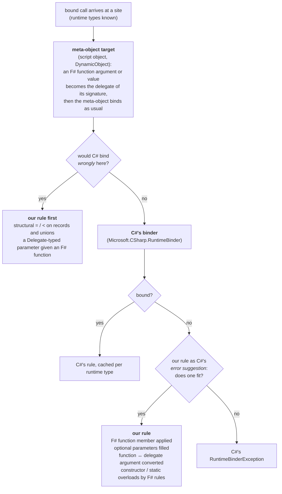

# The F#-aware binders: the seam

Where our rules sit relative to C#'s, and what each one does. Part of [internals](internals.md);
the checklist for adding one is the `new-binder` skill.

The library binds with C#'s binder; its own rules sit in the **seam** — where F# code hands that
binder what C# code does not (a function value, an `FSharpOption` optional, a record without
`op_Equality`, `<` on a string) and C# fails or binds against F#'s expectation. A rule that would
change what C# binds for C#'s own inputs does not belong here; the one deliberate exception is
`?=?` / `?<?` on any CLR type without the operator — structural rather than reference, F# type or
not ([comparison operators](#comparison-operators)). Inside the seam the choice among candidates
is `tryInvoke`'s own (most exact slots, then fewest omitted), neither C#'s nor F#'s. An F#-rules
binder would differ from C#'s mostly in the conversions it refuses (F# widens less) and in which
of two fitting overloads it prefers; it would bind nothing the seam does not already.

## Where a rule goes

The rule from `CLAUDE.md`, drawn once: ours goes before C#'s only where C# would bind *wrongly*
rather than fail; everywhere else it is C#'s error suggestion, so a member C# can bind is bound
exactly as C# would. The seam is the `ours1`, `ours2` and `meta` boxes. Both paths produce DLR rules restricted on runtime types, so the decision is
cached per type like everything else.

## Invocation

The C# binder invokes delegates and dynamic objects; an F# function value is an `FSharpFunc`
object, which it reports as "Cannot invoke a non-delegate type". Three binders in `Binders.fs`
subclass the DLR's binder types, wrap C#'s, and add the F# case in the fallbacks:

- **`FSharpInvokeMemberBinder`** (`x?Name(args)`). `FallbackInvokeMember` (a CLR target): if the
  type has an accessible property or field of that name whose type is a fitting `FSharpFunc`
  shape and no method of that name, the rule reads and applies it; otherwise C#'s binding — with
  a rule for a method whose F# optional parameters (`?arg`, i.e. `[<OptionalArgument>]
  FSharpOption<'T>`) the arguments fit once omitted ones are `None` and bare values `Some`,
  offered as the *error suggestion*, which C# uses only where its own binding fails
  (`OptionalArguments.tryCall`). `FallbackInvoke` (a dynamic target has produced the member's
  value): delegates to `FSharpInvokeBinder`.
- **`FSharpInvokeBinder`** (`Dlr.call` / `Dlr.apply`, and the value step above). `FallbackInvoke`: if the value's
  runtime type is a candidate, a rule applying it restricted to that type; otherwise C#'s `Invoke`.
  A value-less meta-object (Expando's `BindInvokeMember` hands over the member before evaluating
  it) is `Defer`red, so the nested site binds through this binder with the value.
- **`FSharpReadOrInvokeBinder`** (`x?Name` read as `unit -> R`). A parameterless method is
  invoked; a property or field is read (and applied if it is an F# function); on a dynamic
  target the value itself is the result unless it is a delegate or function.

The shape is read off the *function's* type — the runtime type of a dynamic value, the declared
type of a CLR member — never off the call's declared result: `FSharpFunc<A * B, R>` (tupled) or
`FSharpFunc<A, FSharpFunc<B, R>>` (curried) whose domains the argument types fit. The rule is
built for any arity: a tuple construction and one `Invoke` for tupled (the tuple nested past seven
elements, as the CLR's are), a chain of `Invoke` calls for curried (each step's result is the next
function; `OptimizedClosures` override `Invoke` too, so the chain is correct, just not
`InvokeFast`), the result boxed for the site's `Convert`.
So a discarded call or a widened result still applies the function that is there. A CLR member
whose declared type says nothing (`obj`, an interface) is read and handed to a nested `Invoke`
site that decides by the value's runtime type. Reading a member *as* a function
(`FunctionMember.CurriedN`/`TupledN`) constructs an F# closure and so has per-arity helpers up to
five like `OptimizedClosures`; past five, `FunctionBuilder` compiles a factory once per (function
type, site type) — so a computed name's per-key sites reuse it — a LINQ lambda taking the sites
and the target and returning the function: tupled, one
`CurriedStep` taking the whole tuple (any length, its elements read through `Rest`); curried, a
`CurriedStep` per argument. A step is one object holding the step before it (the first, the sites
and the target), its argument and a `next` compiled once; the last reads the arguments back along
the chain and calls the site: what F# emits past `OptimizedClosures`, with no closure per step
(`Tests/HotPath.fs` pins the bytes). Not a `ValueTuple` of everything so far: a struct over
references as a generic argument put each step on the runtime's slow shared-generic path. Typed throughout (no boxing, no
`DynamicInvoke`), so what it throws arrives as itself, as at five and under. The sites stay
`CallSite` constants in the quotation, so a computed name's per-key sites substitute them. The argument
types a shape has to fit are the meta-objects' `LimitType`s — the runtime type of an `obj`-typed
argument, the static type of a typed one — matching the site's own argument rules; a null value
fits any reference-type domain whatever its static type (an untyped `null` is `obj`), and the
rule carries an instance restriction for it — a type restriction can never hold for null, and a
rule that fails its own test makes the DLR re-bind forever. Our reflection
lookups (function members, optional-parameter methods, constructors, static overloads) apply the
same accessibility rule as C#'s binder, from the same context type — [restrictions](restrictions.md)
states it; `Accessibility` in `Binders.fs` applies it, to the member and to its declaring type at
every nesting level. Named or generic calls use C#'s binder unchanged. A member read as `… -> unit` is invoked through a void, result-discarded site.

## The reflection fallback

One `tryInvoke` over candidates — instance methods (`tryCall`), the static methods of
`Dlr.Static<T>.Overloads` (`tryStaticCall`, through `FSharpStaticInvokeMemberBinder`),
constructors (`tryConstruct`, through `FSharpInvokeConstructorBinder`: C#'s constructor binder
takes no error suggestion, its failure is a rule that throws, so ours applies exactly when C#'s
bind is that throw) and a delegate target's `Invoke` (`tryInvokeDelegate`, from
`FSharpInvokeBinder`; a delegate-typed member is routed to that nested site).
`FunctionShapes.applyCall` takes the same conversions through a hook (`convertArgument`, set once
`OptionalArguments` exists), so an F# function member whose domain is a delegate or a function
accepts the other kind too.

## Functions and delegates

The fallback (`OptionalArguments.tryCall`, C#'s error suggestion) converts an F# function
argument for a delegate parameter and a delegate argument for a function parameter.

*Meta-object targets* have no parameter types to drive that, so `MetaObjectArguments` converts an
F# function argument or value by the function's own signature (`int -> unit` to `Action<int>`,
`(int * string) -> bool` to `Func<int, string, bool>`; a curried `int -> int -> int` is one
`Func<int, int, int>`, its domains flattened as the seam's delegate conversion does elsewhere) before the meta-object binds: every script
host and `DynamicObject` understands delegates, none an `FSharpFunc`. The standard binders seal
`Bind`, so `MetaObjectAwareBinder` wraps the invoke, apply, set-member and set-index binders, and
the AddAssign/SubtractAssign step of `Dlr.addAssign`'s read-modify-write — a COM event reads as a
bound event that takes `+=` of a delegate only (#132) — (not the nested invoke of a member read as a
callable value) and answers that case
with a nested site on the real binder whose arguments are the delegates — a `DynamicObject` insists
each argument be the site's own parameter, which the nested site's are; every other bind goes
straight through. Restricted on the target's type, each function's `FSharpFunc<_, _>` type and each other
argument's type, so one rule per argument-type combination. CLR targets are untouched: there the parameter type decides.

*Function to delegate*: a `FunctionAdapters` instance (`Adapters.fs`, generated by
`generate-adapters.fsx`) whose `Invoke` has the delegate's exact signature (curried/tupled ×
result/void, 0–16 parameters; `OptimizedClosures` for curried up to five), built per call by a
factory emitted once per (function type, delegate type) as IL — `new Adapter(f)` and the
delegate constructor over `Invoke` — an allocation and a constructor call, where
`Delegate.CreateDelegate` per call or a LINQ closure would be an order of magnitude more; past
sixteen parameters (a custom delegate type), a compiled
lambda applying the function.

*Delegate to function*: a typed `DelegateFunctions` wrapper (`FSharpFunc` subclass calling the
delegate's `Invoke`; `OptimizedClosures` for curried, so `f a b` is one call) over the delegate
rebound to the `Func`/`Action` of its signature, again constructed by emitted IL; past five
parameters a `FunctionBuilder` factory compiled once per (function type, delegate type), calling
the delegate type's own `Invoke`. The binder converts only a delegate whose signature matches the
function's exactly (a mismatch is C#'s binder error); `DelegateFunction.Make` called with a
non-matching pair falls back to `TupledDelegateFunction`/`CurryStep` with `DynamicInvoke`, which
no bound call reaches. Not `FuncConvert`, whose
wrapper loses arguments on Mono's browser-wasm runtime. A related wasm fault, a nested
non-capturing lambda losing its arguments, is why every lambda and delegate literal written in a
block is made to capture the closure parameter there (`capturing` in `Translate.fs`, a no-op
elsewhere).

*Delegate literals in a block* (`w?Each(Action<string>(fun s -> …))`) compile with the block, as
`DynamicMethod` delegates whose `.Method` starts with a hidden `Closure` parameter — a consumer
marshalling by `.Method` (NLua does) sees `(Closure, string)` and refuses it. The translator wraps
each in `DelegateLiteral<'D>.Over`, a delegate of the same type over the inner one's `Invoke`
(emitted IL, or `CreateDelegate`), so `.Method` is the delegate type's own `Invoke` and
`.Target` the inner delegate: an allocation per block run and one indirection per call, about 20 ns on the
block, for delegate literals inside blocks — and for the seam's own past-sixteen-parameter
conversion, the one shape it builds as a compiled lambda rather than an adapter class
(`Tests/Delegates.fs`; NLua's `each` and its seventeen-argument `wide`).

Cost: a converted argument (either direction) makes a bound call several times the cost of one
whose arguments need no conversion — the adapter allocation and the second delegate hop — and
[benchmarks.md](benchmarks.md) has the F#-lambda-for-a-`Func`-parameter row against C#'s `Func`
literal. Calls of a curried F# function member go through `InvokeFast` (one call, no intermediate
closures); the `w?Fn(1, 2)` row there is that path, a small constant over a CLR method call.

A delegate's own members are looked up through `DelegateMembers`, public or not: F# compiles a
delegate's `Invoke` and constructor at the type's accessibility, so an `internal` F# delegate's
are internal where C#'s stay public, and a public-only lookup missed every conversion (either
direction) and the `Dlr.call` fallback for it (#150). .NET Framework does the same in two places
of its own: `Expression.Lambda` (a lambda at such a delegate type is compiled at the public one of
the same signature, `Func`/`Action` or emitted past sixteen, and rebound: `DelegateMembers.standIn`)
and `Expression.Invoke`, which C#'s Invoke binder builds and so crashes on one — there, and only
there, `FSharpInvokeBinder` puts our delegate rule (an explicit `Invoke` call) before C#'s
(`DelegateMembers.csharpCannotInvoke`).

A parameter typed `Delegate` itself (WinForms `Control.Invoke`) gets the `Func`/`Action` F# would
build for the function, and this rule goes *before* C#'s: left to C#, `FSharpFunc`'s own
`op_Implicit` yields a `Converter<Unit, R>` for a `unit -> R`, a one-parameter delegate that a
`DynamicInvoke()` then rejects.

## Comparison operators

`FSharpBinaryOperationBinder` wraps C#'s for the six comparison operators. C# first when either
operand is a type it covers — primitive, enum, decimal, delegate, string and bool for `==`/`!=`
only (C# has no ordering for them), a dynamic object (whose own rule reaches us as C#'s error
suggestion) — or declares the CLR operator (`op_Equality` and friends, including inherited);
otherwise, and this is the one place our rule goes *before* C#, because C# would silently bind
reference equality for a record, the rule is `LanguagePrimitives.GenericEquality`/
`GenericComparison` on the boxed operands, restricted on both runtime types
(instance-restricted for a null). Non-comparable types fail the way F#'s `compare` fails, with an
`ArgumentException`. Arithmetic and bitwise operators are C#'s alone.
