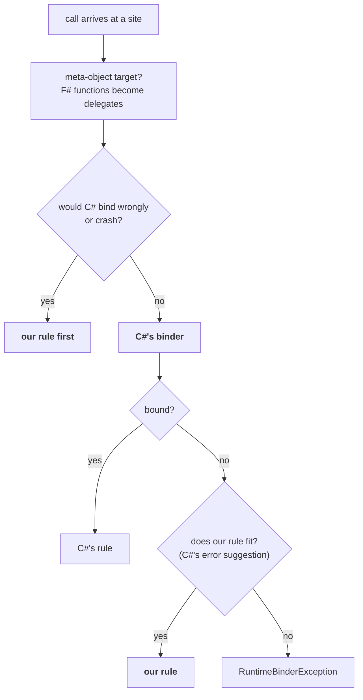

# The F#-aware binders: the seam

Where our rules sit relative to C#'s, and what each one does. Part of [internals](internals.md);
the checklist for adding one is the `new-binder` skill.

The library binds with C#'s binder. Its own rules sit in the **seam**: where F# code hands that
binder what C# code does not (a function value, an `FSharpOption` optional, a record without
`op_Equality`, `<` on a string), and C# fails or binds against F#'s expectation.

- A rule that would change what C# binds for C#'s own inputs does not belong here. The one
  deliberate exception is `?=?` / `?<?` on any CLR type without the operator: structural rather
  than reference, F# type or not ([comparison operators](#comparison-operators)).
- Inside the seam, the choice among candidates is `tryInvoke`'s own (most exact slots, then
  fewest omitted), neither C#'s nor F#'s.
- An F#-rules binder would differ from C#'s mostly in the conversions it refuses (F# widens
  less) and in which of two fitting overloads it prefers; it would bind nothing the seam does
  not already.

## Where a rule goes

Ours goes before C#'s only where C# would bind *wrongly*, or crash, rather than fail (the rule
from `CLAUDE.md`). Everywhere else it is C#'s error suggestion, so a member C# can bind is bound
exactly as C# would.

**Our rule first** (`ours1`):
- structural `=` / `<` on records and unions;
- a `Delegate`-typed parameter or slot given an F# function;
- an F# internal delegate invoked on .NET Framework.

**Our rule as C#'s error suggestion** (`ours2`):
- an F# function member applied;
- F# optional parameters filled;
- a function ↔ delegate argument converted;
- constructors and static overloads by the same rules.

**Meta-object targets** (`meta`; a script object, a `DynamicObject`): an F# function argument or
value becomes the delegate of its signature, then the meta-object binds as usual.

The invoke, set-member and set-index binders state which case they are in through
`Seam.oursFirstWhen`; structural `==` and a `Delegate`-typed parameter decide in their own
binders (`FSharpBinaryOperationBinder`, `FSharpInvokeMemberBinder`). Both paths produce DLR rules
restricted on runtime types, so the decision is cached per type like everything else.

## Invocation

The C# binder invokes delegates and dynamic objects. An F# function value is an `FSharpFunc`
object, which it reports as "Cannot invoke a non-delegate type". The invocation binders in
`Seam.fs` subclass the DLR's binder types, wrap C#'s, and add the F# case in the fallbacks.
These three carry the function rule:

- **`FSharpInvokeMemberBinder`** (`x?Name(args)`).
  - `FallbackInvokeMember` (a CLR target): if the type has an accessible property or field of
    that name whose type is a fitting `FSharpFunc` shape, and no method of that name, the rule
    reads and applies it.
  - Otherwise C#'s binding, with our rules as the *error suggestion*, which C# uses only where
    its own binding fails (`Fallback.tryCall`): that function-valued member, or a method whose F#
    optional parameters (`?arg`, i.e. `[<OptionalArgument>] FSharpOption<'T>`) the arguments fit
    once omitted ones are `None` and bare values `Some`.
  - `FallbackInvoke` (a dynamic target has produced the member's value): delegates to
    `FSharpInvokeBinder`.
- **`FSharpInvokeBinder`** (`Dlr.call` / `Dlr.apply`, and the value step above).
  `FallbackInvoke`: if the value's runtime type is a candidate, a rule applying it, restricted
  to that type; otherwise C#'s `Invoke`. A value-less meta-object (Expando's `BindInvokeMember`
  hands over the member before evaluating it) is `Defer`red, so the nested site binds through
  this binder with the value.
- **`FSharpReadOrInvokeBinder`** (`x?Name` read as `unit -> R`). A parameterless method is
  invoked; a property or field is read (and applied if it is an F# function); on a dynamic
  target the value itself is the result unless it is a delegate or function.

Named or generic calls use C#'s binder unchanged (only the meta-object argument rule still
applies to them). A member read as `… -> unit` is invoked through a void, result-discarded site.

### Function shapes

The shape is read off the *function's* type, never off the call's declared result: the runtime
type of a dynamic value, the declared type of a CLR member. It is `FSharpFunc<A * B, R>`
(tupled) or `FSharpFunc<A, FSharpFunc<B, R>>` (curried), whose domains the argument types fit.
So a discarded call or a widened result still applies the function that is there.
The `w?Fn(1, 2)` row of [benchmarks.md](benchmarks.md) is the curried path through
`InvokeFast`: a small constant over a CLR method call.

The rule is built for any arity, its result boxed for the site's `Convert`:

- **tupled**: a tuple construction and one `Invoke` (the tuple nested past seven elements, as
  the CLR's are);
- **curried**: one `Invoke` for one argument; `InvokeFast` for two to five (one call, no
  intermediate closures, as F# compiles `f a b`); past that, a chain of `Invoke` calls, each
  step's result the next function (`OptimizedClosures` override `Invoke` too, so the chain is
  correct).

Which argument types a shape has to fit:

- The meta-objects' `LimitType`s: the runtime type of an `obj`-typed argument, the static type
  of a typed one, matching the site's own argument rules.
- A null value fits any reference-type domain but `unit`, whatever its static type. (An untyped
  `null` is `obj`; not `unit`, or a one-argument call could bind a zero-argument function.) The
  rule carries an instance restriction for it: a type restriction can never hold for null, and
  a rule that fails its own test makes the DLR re-bind forever.

A CLR member whose declared type says nothing (`obj`, an interface, an abstract class), and a
delegate-typed member (so its arguments get the function/delegate conversions), is read and
handed to a nested `Invoke` site that decides by the value's runtime type.

### Reading a member as a function

Reading a member *as* a function (`FunctionMember.CurriedN`/`TupledN`) constructs an F# closure,
so it has per-arity helpers up to five, like `OptimizedClosures`.

Past five, `FunctionBuilder` compiles a factory once per (function type, site type), so a
computed name's per-key sites reuse it. The factory is a LINQ lambda taking the sites and the
target and returning the function:

- tupled: one `CurriedStep` taking the whole tuple (any length, its elements read through
  `Rest`);
- curried: a `CurriedStep` per argument.

A step is one object holding the step before it (the first: the sites and the target), its
argument and a `next` compiled once; the last reads the arguments back along the chain and calls
the site. That is what F# emits past `OptimizedClosures`, with no closure per step
(`Tests/HotPath.fs` pins the bytes).

- Not a `ValueTuple` of everything so far: a struct over references as a generic argument put
  each step on the runtime's slow shared-generic path.
- Typed throughout (no boxing, no `DynamicInvoke`), so what it throws arrives as itself, as at
  five and under.
- The sites stay `CallSite` constants in the quotation, so a computed name's per-key sites
  substitute them.

### Accessibility

Our reflection lookups (function members, optional-parameter methods, constructors, static
overloads) apply the same accessibility rule as C#'s binder, from the same context type.
[Restrictions](restrictions.md) states it; `Accessibility` in `Reflection.fs` applies it, to the
member and to its declaring type at every nesting level.

## The reflection fallback

One `tryInvoke` over candidates:

- instance methods (`tryCall`);
- the static methods of `Dlr.Static<T>.Overloads` (`tryStaticCall`, through
  `FSharpStaticInvokeMemberBinder`);
- constructors (`tryConstruct`, through `FSharpInvokeConstructorBinder`). C#'s constructor
  binder takes no error suggestion: its failure is a rule that throws, so ours applies exactly
  when C#'s bind is that throw;
- a delegate target's `Invoke` (`tryInvokeDelegate`, from `FSharpInvokeBinder`; a delegate-typed
  member is routed to that nested site).

Every one of them fits an argument to a typed slot through `Fallback.convertValue`:

- assignable, or C#-widened;
- a null for a reference or nullable slot;
- or a `conversion`: function ↔ delegate, or a function for a `Delegate` slot.

`fit` layers an F# optional parameter's `Some` on top; the byref binder uses it too.
`FunctionShapes.applyCall` takes the conversions through a hook (`convertArgument`, set to
`conversion` once `Fallback` exists), so an F# function member whose domain is a delegate, a
function or `Delegate` accepts the other kind too.

## Function and delegate conversions

### Arguments and assignment

The fallback (`Fallback.tryCall`, C#'s error suggestion) converts an F# function argument for a
delegate parameter, and a delegate argument for a function parameter.

Assignment takes the same conversions (#153): `FSharpSetMemberBinder` and `FSharpSetIndexBinder`
offer `Fallback.trySet` as C#'s error suggestion. A property's or indexer's setter is called
through the same `tryInvoke` (indexes, then the value); a field or array element is assigned
the converted value. So these bind where C# reports "cannot implicitly convert":

- `x?Handler <- fun a b -> …` against a `Func<int, int, int>` property;
- `handlers |> Dlr.setItem "k" (fun x -> …)` into a `Dictionary<string, Func<int, int>>`.

What C# binds itself (a delegate of the slot's type, `FSharpFunc`'s own `op_Implicit` to a
`Converter`) stays C#'s. The exception is a slot typed `Delegate` itself, where, as for a
parameter, ours goes first (`assignsAbstractDelegate`): C# would store that
`Converter<Unit, R>`.

An array is indexed by any integer type C# takes (`int`, `uint`, `long`, `ulong` and the
narrower ones). A struct target is assigned (and, by the call fallback, called) in its box, as
C# does.

### Meta-object targets

Meta-object targets have no parameter types to drive that. Every script host and
`DynamicObject` understands delegates, none an `FSharpFunc`, so `MetaObjectArguments` converts an
F# function argument or value by the function's own signature before the meta-object binds:

- `int -> unit` to `Action<int>`;
- `(int * string) -> bool` to `Func<int, string, bool>`;
- a curried `int -> int -> int` to one `Func<int, int, int>`, its domains flattened as the
  seam's delegate conversion does elsewhere.

The standard binders seal `Bind`, so `MetaObjectAwareBinder` wraps:

- the invoke, apply, set-member and set-index binders;
- the AddAssign/SubtractAssign step of `Dlr.addAssign`'s read-modify-write (a COM event reads as
  a bound event that takes `+=` of a delegate only, #132);
- but not the nested invoke of a member read as a callable value.

It answers that case with a nested site on the real binder whose arguments are the delegates: a
`DynamicObject` insists each argument be the site's own parameter, which the nested site's are.
Every other bind goes straight through. The rule is restricted on the target's type, each
function's `FSharpFunc<_, _>` type and each other argument's type, so there is one rule per
argument-type combination. CLR targets are untouched: there the parameter type decides.

### Function to delegate

A `FunctionAdapters` instance (`Adapters.fs`, generated by `generate-adapters.fsx`) whose
`Invoke` has the delegate's exact signature: curried/tupled × result/void, 0–16 parameters,
`OptimizedClosures` for curried up to five.

- It is built per call by a factory emitted once per (function type, delegate type) as IL:
  `new Adapter(f)` and the delegate constructor over `Invoke`. That is an allocation and a
  constructor call, where `Delegate.CreateDelegate` per call or a LINQ closure would be an order
  of magnitude more.
- Past sixteen parameters (a custom delegate type): a compiled lambda applying the function.

### Delegate to function

A typed `DelegateFunctions` wrapper (an `FSharpFunc` subclass calling the delegate's `Invoke`;
`OptimizedClosures` for curried, so `f a b` is one call), over the delegate rebound to the
`Func`/`Action` of the *function's* signature, again constructed by emitted IL. Past five
parameters, a `FunctionBuilder` factory compiled once per (function type, delegate type), calling
the delegate type's own `Invoke`.

### The signature rule

Both directions follow one rule (`Signatures`): the side that receives a value accepts it.

- The same type, or for reference types the variance delegates have: a `Func<obj, int>` serves a
  `string -> int`, a `Func<int, string>` an `int -> obj`.
- Value types exactly.
- A `void` or `Unit`-returning delegate for a `unit` result.
- Anything else is C#'s binder error.

`DelegateConversions.tryTyped` decides both whether the binder offers a delegate → function
conversion and how it is made. A delegate of another type is rebound over its own `Invoke`, so a
multicast one keeps every target. Among candidates an exact signature counts as an exact match,
so overloads differing only by variance resolve as before.

On wasm:
- An open-instance delegate over a virtual method dispatches non-virtually once rebound: a Mono
  quirk.
- Not `FuncConvert`, whose wrapper loses arguments on Mono's browser-wasm runtime.
- A related fault, a nested non-capturing lambda losing its arguments, is why every lambda and
  delegate literal written in a block is made to capture the closure parameter there
  (`capturing` in `TranslateBlock.fs`, a no-op elsewhere).

### A `Delegate`-typed parameter

A parameter typed `Delegate` itself (WinForms `Control.Invoke`) gets the `Func`/`Action` F#
would build for the function, and this rule goes *before* C#'s. Left to C#, `FSharpFunc`'s own
`op_Implicit` yields a `Converter<Unit, R>` for a `unit -> R`: a one-parameter delegate that a
`DynamicInvoke()` then rejects.

### Cost

A converted argument (either direction) makes a bound call several times the cost of one whose
arguments need no conversion: the adapter allocation and the second delegate hop.
[benchmarks.md](benchmarks.md) has the F#-lambda-for-a-`Func`-parameter row against C#'s `Func`
literal.

## Delegates

### Delegate literals in a block

A delegate literal in a block (`w?Each(Action<string>(fun s -> …))`) compiles with the block, as
a `DynamicMethod` delegate whose `.Method` starts with a hidden `Closure` parameter. A consumer
marshalling by `.Method` (NLua does) sees `(Closure, string)` and refuses it.

The translator wraps each in `DelegateLiteral<'D>.Over`: a delegate of the same type over the
inner one's `Invoke` (emitted IL, or `CreateDelegate`). So `.Method` is the delegate type's own
`Invoke` and `.Target` the inner delegate. It costs an allocation per block run and one
indirection per call, about 20 ns on the block.

It applies to delegate literals inside blocks, and to the seam's own past-sixteen-parameter
conversion, the one shape it builds as a compiled lambda rather than an adapter class
(`Tests/Delegates.fs`; NLua's `each` and its seventeen-argument `wide`).

### Internal delegates

A delegate's own members are looked up through `DelegateMembers`, public or not. F# compiles a
delegate's `Invoke` and constructor at the type's accessibility, so an `internal` F# delegate's
are internal where C#'s stay public. A public-only lookup missed every conversion (either
direction) and the `Dlr.call` fallback for it (#150).

.NET Framework does the same in two places of its own:

- `Expression.Lambda`: a lambda at such a delegate type is compiled at the public one of the
  same signature (`Func`/`Action`, or emitted past sixteen) and rebound: `DelegateMembers.standIn`.
- `Expression.Invoke`, which C#'s Invoke binder builds, and so crashes on one. There, and only
  there, `FSharpInvokeBinder` puts our delegate rule (an explicit `Invoke` call) before C#'s
  (`DelegateMembers.csharpCannotInvoke`).

A byref invoke (`Dlr.call f (…, Dlr.out)`) has the same rule in `FSharpByRefInvokeBinder`: C#'s
error suggestion everywhere, first on .NET Framework for an internal delegate. Its byref
arguments are passed as the site's byref parameters, named arguments matched by name, and the
others fitted by `convertValue` (widening, a nullable's null, an F# function for a delegate
parameter or a delegate for a function one).

## Comparison operators

`FSharpBinaryOperationBinder` wraps C#'s for the six comparison operators.

- **C# first** when either operand is a type it covers, or declares the CLR operator
  (`op_Equality` and friends, including inherited). The types it covers: primitive, enum,
  decimal, delegate, string and bool for `==`/`!=` only (C# has no ordering for them), and a
  dynamic object (whose own rule reaches us as C#'s error suggestion).
- **Otherwise ours, first.** This is the one place our rule goes *before* C#, because C# would
  silently bind reference equality for a record. The rule is
  `LanguagePrimitives.GenericEquality`/`GenericComparison` on the boxed operands, restricted on
  both runtime types (instance-restricted for a null).
- Non-comparable types fail the way F#'s `compare` fails, with an `ArgumentException`.
- Arithmetic and bitwise operators are C#'s alone.
