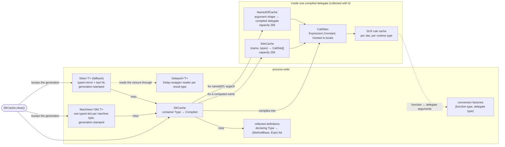

# Caches

Where every piece of state lives, what keys it, and how long it lasts. Part of
[internals](internals.md).

| Cache | Key | Value | Lifetime | Where |
| --- | --- | --- | --- | --- |
| `DlrCache` | the block's container `Type`: its state machine struct, or on the fallback path its Delay closure (one per block; per instantiation for generic members) | `Compiled { Delegate: DlrReader<'SM,'T> or Func<obj,'T>; ResultType }` | process; `DlrCache.clear()` drops it | `Cache.fs` |
| `Machines<'SM,'T>` | the type instantiation itself: one static slot per machine type | the same delegate, already typed `DlrReader<'SM,'T>`, stamped with the clear generation it was compiled under — the hot path: a static field read (no `static let`, so no initialization check), a generation compare, no lookup, no cast | process; `DlrCache.clear()` bumps the generation, so no pre-clear entry is served however it got installed, and a listener (registered on the first compile) nulls the slot | `Cache.fs` |
| `Sites<'T>` | closure `Type`, per result type (fallback path) | the same delegate, already typed `Func<obj,'T>`, generation-stamped; plus a last-compiled slot (an immutable entry swapped atomically) so a block called repeatedly pays a reference compare, not a hash lookup, and blocks called in turn pay a lookup each and never write | as above | `Cache.fs` |
| `Delayed<'T>` | per result type (fallback path): the resumable-code delegate's target type — the builder's `Delay` lambda, one class per `'T` | a compiled reader of its `delayed` field (the identity when the optimizer inlined the lambda and the target is the closure itself), so a call pays a type compare and a delegate invoke, not reflection; other target types go to a dictionary; the library's own wrapper without that field is an error, not the identity | process | `Cache.fs` |
| reflected definitions | declaring `Type` (module or class) | every `(MethodBase, Expr)` with a reflected definition on it and its nested types | process | `Discover.fs` |
| `SiteCache<'Key>` | `string * Type list` — the member name and the explicit type arguments; whichever is static is a constant in the key | the operation's `CallSite[]` for that key | per site (a constant in the compiled tree); at `Capacity` (256) entries it clears and refills | `Binders.fs`, for `(?) x name` with a variable name |
| `NamedOfCache` | the argument shape: names in order, an empty name for a positional (`Dlr.argsOf`) | the operation compiled for that shape (one delegate type per site) | per site; the last two shapes served, then a hash of the names; at `Capacity` (256) entries it clears | `Binders.fs`, for `Dlr.argsOf` / `Dlr.namedOf` |
| `FunctionConversions.conversions`, `DelegateConversions.makers` | (function type, delegate type) | the emitted factory that adapts one to the other | process; bounded by the program's types | `Binders.fs` |
| DLR rule cache | runtime types (restrictions) | the bound rule | per `CallSite<_>` | inside each site, owned by the DLR |

## How they relate

`clear()` drops the compiled delegates and invalidates the typed entries; the next call at each
site recompiles. It does not touch the reflected-definition cache (decoding is per type, and the
definitions have not changed) or the conversion factories (per type pair, and still correct).
Everything inside a delegate — its sites, their rule caches, a `SiteCache` for a
[computed name](call-sites.md#computed-names-and-runtime-type-arguments) — is reachable only from
that delegate and goes with it.

## Bounds

- `DlrCache`, `Machines<'SM,'T>` and `Sites<'T>`: one entry per block (per instantiation of a
  generic member; how each is reached is in the [pipeline](pipeline.md)).
- reflected definitions: one list per type that has had a block looked up in it.
- `SiteCache` and `NamedOfCache`: 256 keys per site, then they clear and refill; concurrent
  misses are admitted under a lock so the bound holds. Both lookups cost the same at any size
  (a dictionary; a hash of the names computed in place, behind a compare with the last two
  shapes served — ~10 ns repeating a shape, ~15 ns alternating two, ~40–50 ns for any other
  pattern at any size, allocating nothing), so the number is a memory bound on a site that fills
  it, measured (Release, arm64): a `SiteCache`
  entry — a site and its rule cache — is ~6.5 KB, so a full site holds ~1.6 MB; a
  `NamedOfCache` entry — the shape's compiled delegate at one arity — ~13 KB, a full site
  ~3.5 MB. A site that reaches either is one keyed by data (below), which the docs steer to
  `Dlr.item`; the numbers are settable (`Capacity`) for a host that knows its working set.
- What these do **not** bound — the computed case only, a literal name or type list being one
  key for ever: Microsoft.CSharp's own symbol table. The first bind of a name against a type
  loads that type's members of that name, for every type in the target's hierarchy, and keeps
  them for the life of the process (~300 B and ~0.3 ms per name per type); a `DynamicObject`
  pays it too, since its meta-object computes C#'s fallback eagerly. This is C# `dynamic`'s
  behaviour with a name from data, and there is no API to clear it. So a stream of distinct
  member names (`(?) x name`) or type lists (`Dlr.typeArgsOf ts`) from untrusted data grows the
  process without bound: allow-list them, or where the target indexes by key (JObject, Python
  dicts, Dapper rows, script objects) use `x |> Dlr.item key` — one member name, `Item`, however
  many keys. A distinct positional count in `Dlr.argsOf` is dearer still (a new site arity and
  an interned binder, ~100 KB and ~8 ms in Release, permanent), so `Dlr.argsOf` takes at most 64 values
  (`NamedOfCache.MaxPositional`): a count from data is then bounded, as a C# call site's arity
  is bounded by its source.
- conversion factories: one per (function type, delegate type) pair that has been converted.
- The DLR's rule caches: the DLR's own policy (a polymorphic cache per site, with a global
  fallback past a handful of rules).
