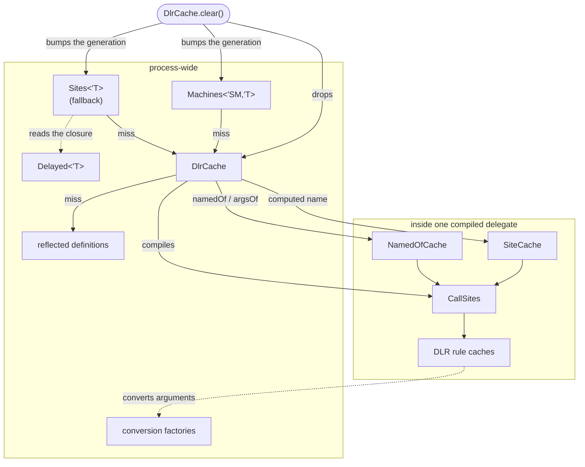

# Caches

Where every piece of state lives, what keys it, and how long it lasts. Part of
[internals](internals.md).

| Cache | Key | Value | Lifetime | Where |
| --- | --- | --- | --- | --- |
| `DlrCache` | the block's container type | `Compiled`: the block's delegate | process; `clear()` drops it | `Cache.fs` |
| `Machines<'SM,'T>` | the machine type: one static slot each | the delegate, typed, generation-stamped | process; `clear()` invalidates it | `Cache.fs` |
| `Sites<'T>` | the closure type, per result type | the delegate, typed, generation-stamped | process; `clear()` invalidates it | `Cache.fs` |
| `Delayed<'T>` | the `Delay` wrapper's type, per result type | a compiled reader of its `delayed` field | process | `Cache.fs` |
| reflected definitions | declaring type | its `(MethodBase, Expr)` pairs, nested types included | process | `Discover.fs` |
| `Discover.undecodable` | declaring type | the members FSharp.Core could not decode | process | `Discover.fs` |
| `SiteCache<'Key>` | (member name, type arguments) | the operation's `CallSite[]` | per site; 256 keys, then cleared | `SiteCaches.fs` |
| `NamedOfCache` | the argument names, in order | the operation compiled for that shape | per site; 256 shapes, then cleared | `SiteCaches.fs` |
| `FunctionConversions.conversions`, `DelegateConversions.makers` | (function type, delegate type) | the adapter factory, or None | process | `Functions.fs` |
| `Binders.factories` | (function type, site type) | the factory for a function past five arguments | process | `Binders.fs` |
| `DelegateLiteral<'D>`, `ParameterlessLiteral<'D,'R>` | the delegate type: a static field each | the re-wrap factory | process | `Functions.fs` |
| `Accessibility.opensTo` | (declaring assembly, calling assembly) | whether `[<InternalsVisibleTo>]` opens one to the other | process | `Reflection.fs` |
| DLR rule cache | the runtime types (restrictions) | the bound rule | per `CallSite` | the DLR |

## What the entries hold

- **`DlrCache`** is keyed by the block's state machine struct; on the fallback path by its Delay
  closure's class, or, for a capture-free block left with a static delegate, the class that
  delegate's method lives in. One entry per block (per instantiation of a generic member). The
  value is `Compiled { Delegate: DlrReader<'SM,'T> or Func<obj,'T> }`.
- **`Machines<'SM,'T>`** is the hot path: a static field read (no `static let`, so no
  initialization check) and a generation compare — no lookup, no cast. `clear()` bumps the
  generation, so no entry from before it is served however it got installed, and a listener
  registered on the first compile nulls the slot.
- **`Sites<'T>`** (fallback path) also keeps the last block compiled, an immutable entry swapped
  atomically: a block called repeatedly pays a reference compare, not a lookup; blocks called
  in turn pay a lookup each and never write. For a capture-free block's static delegate it keeps
  the last delegate seen with its class (`lastCode`, a `CodeHit` pair), so `Delegate.Method` is
  not resolved per call.
- **`Delayed<'T>`**: the target is the builder's `Delay` lambda, one class per `'T`, so a call
  pays a type compare and an invoke, not reflection. When the optimizer inlined the lambda the
  target is the closure itself and the reader is the identity; other target types go to a
  dictionary; the library's own wrapper without the field is an error.
- **`SiteCache`** serves `(?) x name` with a variable name and `Dlr.typeArgsOf` with a run-time
  list; whichever of the two is static is a constant in the key. **`NamedOfCache`** serves
  `Dlr.argsOf` / `Dlr.namedOf`: an empty name stands for a positional value, every shape of a site
  shares one delegate type, and a lookup compares the last two shapes served before hashing the
  names. Both are constants in the compiled tree; their cost and bounds are below.
- **The conversion factories** cache a pair that does not convert too (as None): the binder asks
  per candidate parameter.
- **`Binders.factories`** is shared by a computed name's per-key sites.
- **`DelegateLiteral` / `ParameterlessLiteral`** re-wrap a delegate literal on its own `Invoke`
  (a parameterless one: the delegate over its thunk).

## How they relate

`clear()` drops the compiled delegates and invalidates the typed entries; the next call at each
site recompiles. It does not touch the reflected-definition cache (decoding is per type, and the
definitions have not changed) or the conversion factories, `Binders.factories` and the delegate-literal factories (per type, and still correct).
Everything inside a delegate — its sites, their rule caches, a `SiteCache` for a
[computed name](call-sites.md#computed-names-and-runtime-type-arguments) — is reachable only from
that delegate and goes with it.

## Bounds

- `DlrCache`, `Machines<'SM,'T>` and `Sites<'T>`: one entry per block (per instantiation of a
  generic member; how each is reached is in the [pipeline](pipeline.md)).
- reflected definitions: one list per type that has had a block looked up in it.
- `SiteCache` and `NamedOfCache`: 256 keys per site, then they clear and refill; concurrent
  misses are admitted under a lock so the bound holds. A lookup costs the same at any size:
  - `SiteCache`: a dictionary; its key tuple is the one allocation per call (32 B).
  - `NamedOfCache`: ~10 ns repeating a shape, ~15 ns alternating two, ~40–50 ns for any other
    pattern; nothing allocated beyond the `obj[]` of splatted values.

  So 256 is a memory bound on a site that fills it. Measured (Release, arm64): a `SiteCache`
  entry (a site and its rule cache) is ~6.5 KB, ~1.6 MB for a full site; a `NamedOfCache` entry
  (the shape's compiled delegate) ~13 KB, ~3.5 MB for a full site. A site that gets there is
  keyed by data (below), which the docs steer to `Dlr.item`; `Capacity` is settable for a host
  that knows its working set.
- What these do **not** bound — the computed case only, a literal name or type list being one
  key for ever: Microsoft.CSharp's own symbol table. The first bind of a name against a type
  loads that type's members of that name, for every type in the target's hierarchy, and keeps
  them for the life of the process (~300 B and ~0.3 ms per name per type); a `DynamicObject`
  pays it too, since its meta-object computes C#'s fallback eagerly. This is C# `dynamic`'s
  behaviour with a name from data, and there is no API to clear it. So a stream of distinct
  member names (`(?) x name`) or type lists (`Dlr.typeArgsOf ts`) from untrusted data grows the
  process without bound: allow-list them, or where the target indexes by key (JObject, Python
  dicts, Dapper rows, script objects) use `x |> Dlr.item key` — one member name, `Item`, however
  many keys. A distinct positional count in `Dlr.argsOf` is dearer still (a new site arity and
  an interned binder, ~100 KB and ~8 ms in Release, permanent), so `Dlr.argsOf` takes at most 64 values
  (`NamedOfCache.MaxPositional`): a count from data is then bounded, as a C# call site's arity
  is bounded by its source.
- conversion factories: one per (function type, delegate type) pair that has been converted.
- The DLR's rule caches: the DLR's own policy (a polymorphic cache per site, with a global
  fallback past a handful of rules).
