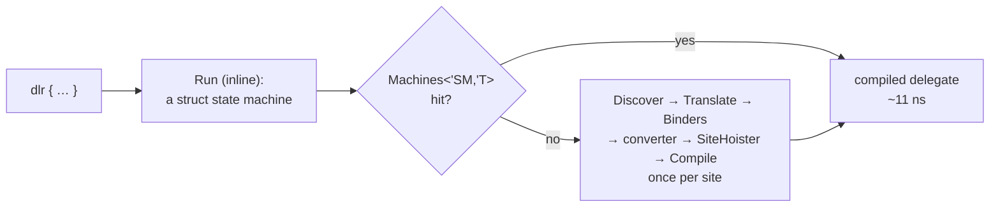

# Internals

What a `dlr { }` block turns into at run time, and where every piece of state lives. The README
covers usage; these pages are for reading or changing the library.

- [**Pipeline**](pipeline.md) — from the CE desugaring to the delegate: the resumable-code
  `Run`, `Machines<'SM, 'T>` (and the closure fallback, `Sites<'T>`), `DlrCache`, `Discover`,
  `Translate`, the converter, `SiteHoister`; a sequence diagram of one call on the hot path and
  of a first call; spot measurements.
- [**Caches**](caches.md) — every cache, its key, value and lifetime; how they relate and what
  `DlrCache.clear()` touches; the bounds.
- [**Call sites**](call-sites.md) — one `CallSite` per operation, the argument flags, the site
  for each piece of syntax, `SiteCache` for computed names and runtime type arguments, and why
  the sites are hoisted into locals.
- [**Binders**](binders.md) — the F#-aware binders: the decision flow (ours before C#'s only
  where C# would bind wrongly), invocation of F# function values, optional parameters, the
  function ↔ delegate conversions, structural comparison.
- [**Translation**](translation.md) — normalisation, the `Plumbing` / `Members` / `Captures`
  split, captured variables, control flow through `DlrRuntime`, nested blocks, and what the
  translator assumes about the compiler.
- [**Benchmarks**](benchmarks.md) — generated by `Benchmarks/bench.sh docs`; the source of every
  number quoted above.
