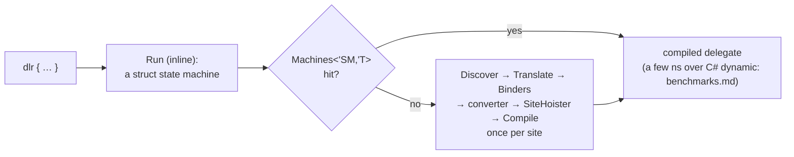

# Internals

What a `dlr { }` block turns into at run time, and where every piece of state lives. Usage is the
README, [syntax](syntax.md) and [restrictions](restrictions.md); these pages are for reading or
changing the library.

- [**Pipeline**](pipeline.md) — from the CE desugaring to the delegate: the resumable-code
  `Run`, `Machines<'SM, 'T>` (and the closure fallback, `Sites<'T>`), `DlrCache`, `Discover`,
  `Translate`, the converter, `SiteHoister`; a sequence diagram of one call on the hot path and
  of a first call; spot measurements.
- [**Caches**](caches.md) — every cache, its key, value and lifetime; how they relate and what
  `DlrCache.clear()` touches; the bounds.
- [**Call sites**](call-sites.md) — one `CallSite` per operation, the argument flags, the site
  for each piece of syntax, `SiteCache` for computed names and runtime type arguments,
  `NamedOfCache` for `Dlr.namedOf` / `Dlr.argsOf` shapes, wide sites past 14 arguments (and
  wasm), and why the sites are hoisted into locals.
- [**Binders**](binders.md) — the seam: C#'s binder with F# rules only where it fails or binds
  against F#'s expectation on what F# hands it — the decision flow (ours before C#'s only where
  C# would bind wrongly), invocation of F# function values, optional parameters, the function ↔
  delegate conversions, structural comparison.
- [**Translation**](translation.md) — normalisation, the `Plumbing` / `Members` / `Captures`
  split, captured variables, control flow through `DlrRuntime`, nested blocks, and what the
  translator assumes about the compiler.
- [**Compiled trees**](trees.md) — what a few blocks compile to at run time, rendered as C#-like
  source; generated by `docs/trees`.
- [**Benchmarks**](benchmarks.md) — generated by `Benchmarks/bench.sh docs`; the source of every
  number quoted above.

The library's files, in compile order: `Operators.fsi`/`Operators.fs` (the markers), `Adapters.fs`
(generated), `Runtime.fs`, `Reflection.fs` (accessibility, conversions, tuples, delegate members,
the signature rule, IL emits), `Functions.fs` (function shapes and the function ↔ delegate
conversions), `Seam.fs` (the reflection fallback and the binders), `SiteCaches.fs`, `Binders.fs`
(site emission), `TranslatePatterns.fs` (markers, patterns, `normalize`), `SiteHoister.fs`,
`TranslateBlock.fs` (`Block`, `Captures`, `Plumbing`), `TranslateMembers.fs` (the marker
operations), `Translate.fs` (`translate`), `Discover.fs`, `Cache.fs`, `Builder.fsi`/`Builder.fs`.

The names these pages put in backticks — types, members, files — are checked against the sources by
`docs/check-identifiers.fsx`, part of the gate: a rename the docs did not follow fails it.
