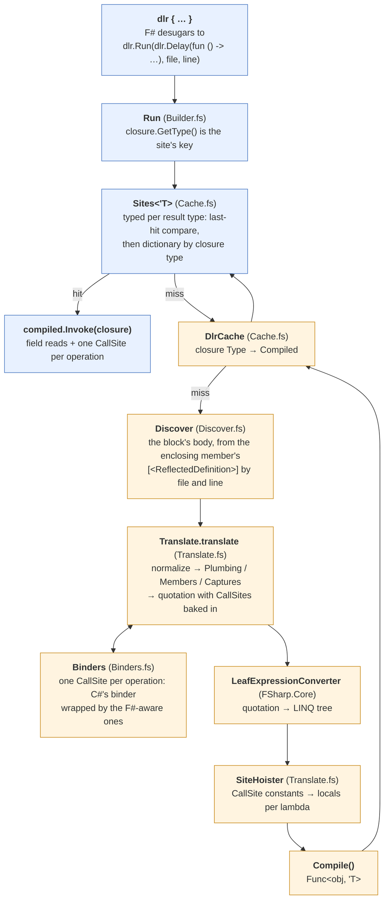
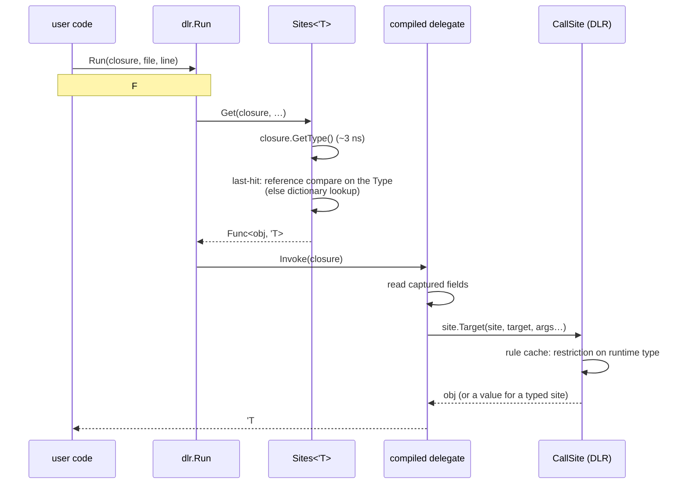
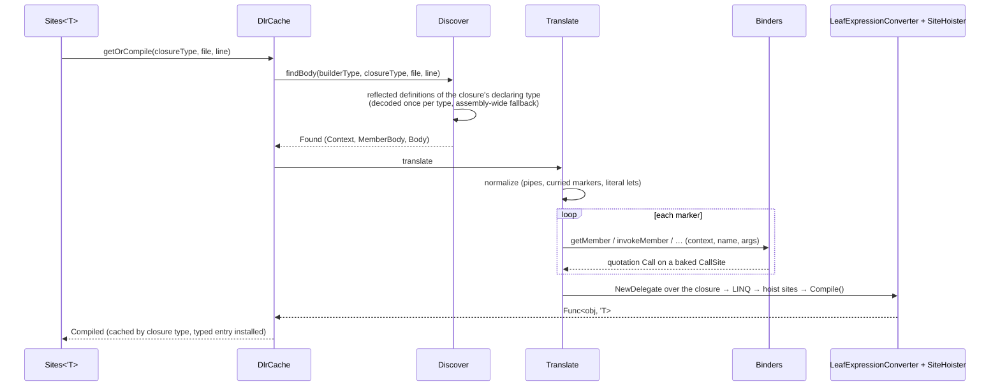

# The pipeline

From `dlr { … }` in source to the delegate a call invokes, and what one call costs. Part of
[internals](internals.md).

## From source to delegate

Blue is every call; orange is the first call at a site (and again after `DlrCache.clear()`).

`Delay` returns the closure unevaluated. `Run` never executes it; it is the call site's identity
(its type) and the source of the captured values (its fields). The compiled delegate takes that
closure as its one parameter and reads the captured variables off its fields.

## One call on the hot path

About 20 ns for `w?Add(i, 1)` against 7.5 for C# `dynamic`: what remains is the block's entry
(the closure, `GetType()`, the compare, the invoke); the site call itself is C#'s.

## The first call at a site

Microseconds to low milliseconds, once per site: decoding the reflected definition (per type),
building the binders and sites, `Compile()`. The DLR's own first bind per site (the rule) is
paid on the first invoke like any C# `dynamic` call site.

## Measured

Release, net10.0, Apple Silicon; the current numbers for every path are in
[benchmarks.md](benchmarks.md) (`Benchmarks/bench.sh docs`). Older spot measurements, for the
function-member paths:

| | ns |
| --- | --- |
| block, `w?Add(i, 1)` on a method | 18 (was 29 before the hoisted sites and typed cache) |
| block, `e?Fn(i)` with `Fn` an F# function property | 33 |
| one site alternating between the two kinds | 70 |
| bound `int -> int -> int`, full application | 11 |
| bound `unit -> int` property read | 8.5 |
| static `w.Add(i, 1)` | 11–15 |
