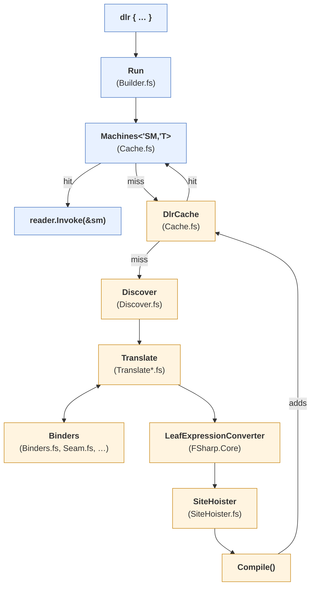
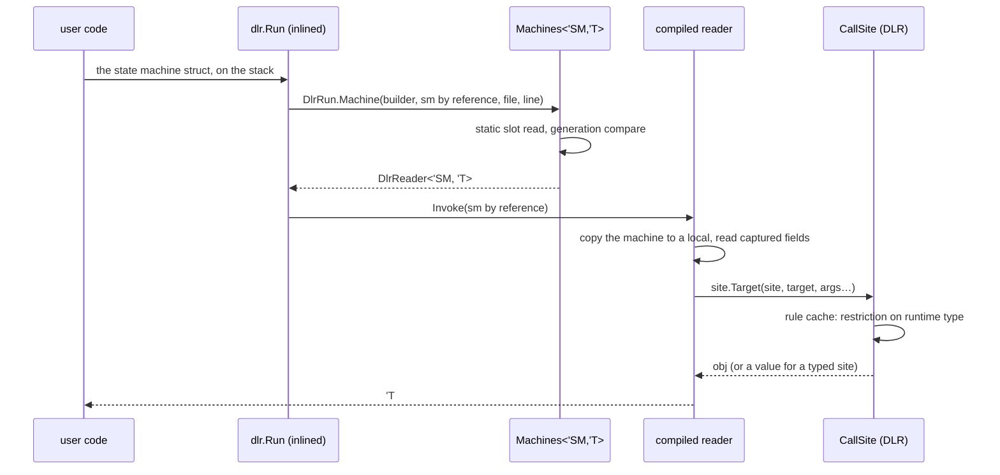
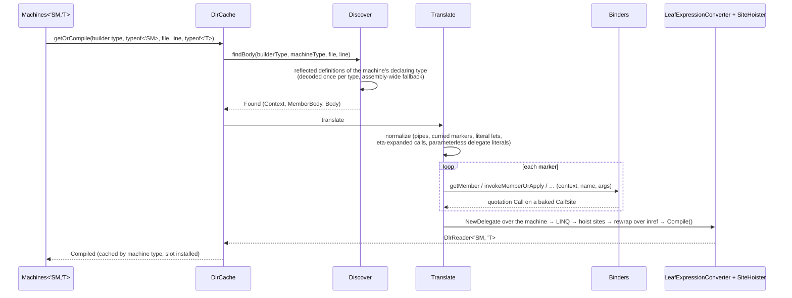

# The pipeline

From `dlr { … }` in source to the delegate a call invokes, and what one call costs. Part of
[internals](internals.md).

## From source to delegate

Blue is every call; orange is the first call at a site (and again after `DlrCache.clear()`).

- **`dlr { … }`**: F# desugars it to `dlr.Run(dlr.Delay(fun () -> …), file, line)`.
- **`Run`**: inline resumable code. The compiler builds a struct state machine `'SM` per block;
  its captured variables are the fields, and `typeof<'SM>` is the key.
- **`Machines<'SM,'T>`**: one static slot per machine type; a hit is a field read and a
  generation compare.
- **`reader.Invoke(&sm)`**: field reads, and one `CallSite` per operation.
- **`DlrCache`**: machine type → `Compiled`.
- **`Discover`**: the block's body, from the enclosing member's `[<ReflectedDefinition>]`, by
  file and line.
- **`Translate.translate`**: `normalize`, then Plumbing / Members / Captures, giving a quotation
  with the `CallSite`s baked in.
- **Binders** (`Binders.fs`; `Seam.fs`, `Functions.fs`, `SiteCaches.fs`): one `CallSite` per
  operation, C#'s binder wrapped by the F#-aware ones.
- **`LeafExpressionConverter`**: quotation → LINQ tree.
- **`SiteHoister`**: `CallSite` constants → locals, per lambda.
- **`Compile()`**: a `DlrReader<'SM, 'T>` (`inref<'SM> -> 'T`).

`Run` is `inline` resumable code in the `task { }` builder's shape (`__stateMachine` with a
`MoveNext` that would run the body and an `AfterCode` that is our entry): the compiler turns
each block into a **struct** whose fields are the captured variables — the machine `task`
would suspend on, used here as the block's container — and hands `AfterCode` a `byref` to it.
`MoveNext` is never called; the struct's type is the call site's identity (a JIT constant in
`DlrRun.Machine<'SM, 'T>`, keying the [`Machines<'SM,'T>` slot](caches.md)) and its fields are
the captured values. The compiled reader takes the machine by reference and reads the captured
variables off its fields ([translation](translation.md)). No closure is allocated and no
`GetType()` runs.

**Fallback.** Where the compiler does not build the machine — Debug builds (`__useResumableCode`
is false without optimization) — `Run`'s `else` branch receives the `ResumableCode`
delegate. `DlrRun.Closure` reads the block's `Delay` closure back out of that delegate's
target (the builder's own `Delay` lambda captures it in a field named `delayed`, read by a
reader compiled once per result type — `Delayed<'T>` — not by reflection per call; when the
optimizer has inlined it, the target itself is the closure) and continues on the closure path:
the closure's type is the key, its fields the captured values, and [`Sites<'T>`](caches.md) the
typed cache (last-hit compare, then a dictionary). Same contract, same `Discover` and `Translate`; the cost
is three allocations (the Delay closure, the builder's wrapper and the `ResumableCode` delegate),
two `GetType()` calls with a reference compare each, and a compiled field read. Both paths are exercised: the suite
runs in Debug and in Release. (Debug builds no state machine at all, so every Debug block takes
the closure path; `Tests/Resumable.fs` fails if an SDK changes that.)

Every `dlr { }` desugars to `Run(Delay(fun () -> …))` in one expression, which the compiler
builds the machine for — with one exception it takes silently, no FS3511: a block whose
function-typed result is applied on the spot, `(dlr { return x?Add } : int -> int -> int) 1 2`
(partially, or through `|>` / `<|`, counts, and so does a function-typed block bound with `let`
and applied once, fully or partially, `let f: int -> int -> int = dlr { … } in f 1 2` or `f 1`, which the optimizer inlines
into that one application: #217, `Tests/Resumable.fs`. Used twice, the binding stays a value and
the block gets its machine. The cause: the optimizer pushes the application into both
branches of `Run`'s `if __useResumableCode`, and the compiler's state-machine recognizer then no
longer sees the `if` at the top, so it emits the `else` branch with no diagnostic).
That goes to the `else` branch in Release too, with the `Delay` wrapper inlined: the delegate's
target is the closure itself when the block captures a value, and null — a static method on the
closure class — when it captures nothing, in which case `DlrRun.Closure` compiles from that
class (`code.Method.DeclaringType`) and passes no closure. (The builder's members called by
hand with the `Delay` result bound or passed separately are the other way in — FS3501 (or
FS3511) from the compiler — and nobody writes that.)

## One call on the hot path

The method-call row of [benchmarks.md](benchmarks.md) puts `w?Add(i, 1)` a few nanoseconds
over C# `dynamic`'s `d.Add(i, 1)`, with no allocation but the box of a value result (the same
box C# pays): what remains of the block's entry is the machine's construction, the slot read
and the invoke; the site call itself is C#'s. (The closure path — the Debug fallback — roughly
doubles the entry with the closure allocation, `GetType()` and the compare. A `Func<'SM, 'T>`
taking the struct by value instead of the `inref` reader measured slower —
[translation](translation.md) has the number.)

What is left over C# is the entry path itself, which measured alone (no site) accounts for the
whole gap, and it is one delegate hop more than C# has: C# emits the site call inline in the
caller and pays one indirect call, into the rule; we pay that plus the call into the compiled
reader (a `DynamicMethod` delegate, through its shuffle thunk), and build and copy the machine
around it. A library cannot remove that hop: the compiled body would have to be emitted into
the caller's own method, which is compiler or source-generator territory (the analyzer
rewriting the block at build time, say). Everything short of that has been measured and taken;
treat the gap as the floor rather than something a faster cache or delegate shape would close.

## The first call at a site

The reflected definition is unaffected by the resumable-code machinery: the quotation is taken
before inlining, so `Discover` still sees `Run(Delay(fun () -> …), file, line)`.

Microseconds to low milliseconds, once per site: decoding the reflected definition (per type,
[cached](caches.md)), building the [binders](binders.md) and [sites](call-sites.md), `Compile()`
after the [sites are hoisted into locals](call-sites.md#sites-hoisted-into-locals). The DLR's own
first bind per site (the rule) is paid on the first invoke like any C# `dynamic` call site.

## Measured

Every number is generated: [benchmarks.md](benchmarks.md), written by `Benchmarks/bench.sh docs`
(Release, net10.0, Apple Silicon), has the block against static calls, cached reflection,
FSharp.Interop.Dynamic and C# `dynamic` for each operation, and the README's short table is
inserted from the same run.

- A member read as an F# function (`let add: int -> int -> int = dlr { return w?Add }`): the
  benchmarks row times the read and one application together. Once bound, each application is
  one site call, like C# `dynamic`'s `d.Add(…)`, without re-entering the block.
- One site alternating between a CLR method and an F# function member has no row: it pays a
  rule-cache miss on every switch, several times the cost of either kind alone.
