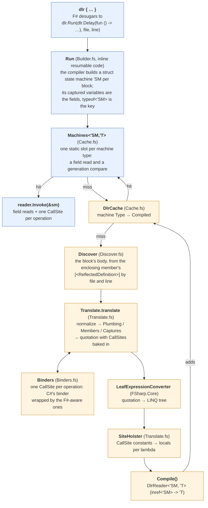
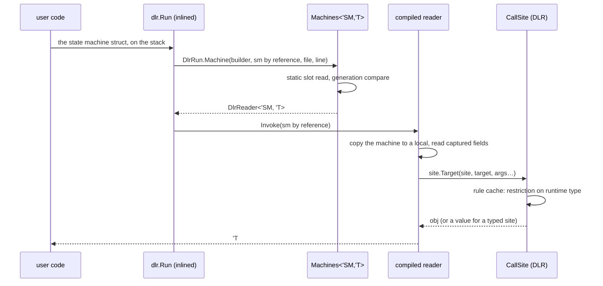
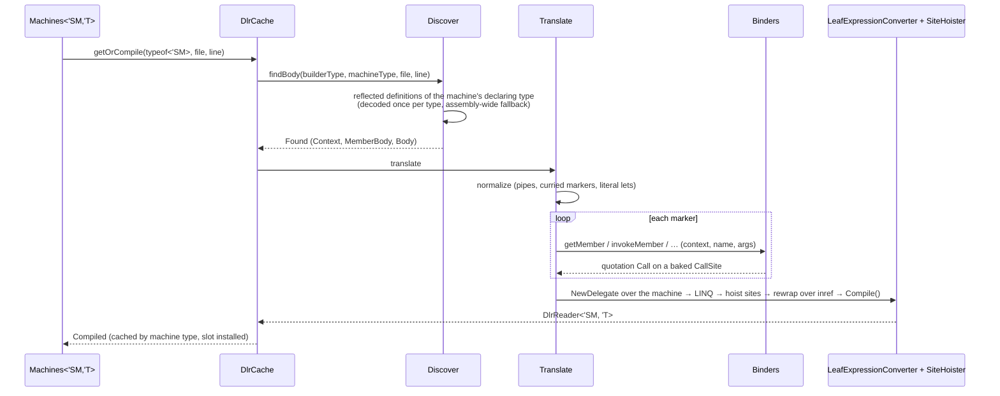

# The pipeline

From `dlr { … }` in source to the delegate a call invokes, and what one call costs. Part of
[internals](internals.md).

## From source to delegate

Blue is every call; orange is the first call at a site (and again after `DlrCache.clear()`).

`Run` is `inline` resumable code in the `task { }` builder's shape (`__stateMachine` with a
`MoveNext` that would run the body and an `AfterCode` that is our entry): the compiler turns
each block into a **struct** whose fields are the captured variables — the machine `task`
would suspend on, used here as the block's container — and hands `AfterCode` a `byref` to it.
`MoveNext` is never called; the struct's type is the call site's identity (a JIT constant in
`DlrRun.Machine<'SM, 'T>`) and its fields are the captured values. The compiled reader takes
the machine by reference and reads the captured variables off its fields. No closure is
allocated and no `GetType()` runs.

**Fallback.** Where the compiler does not build the machine — Debug builds (`__useResumableCode`
is false without optimization) — `Run`'s `else` branch receives the `ResumableCode`
delegate. `DlrRun.Closure` reads the block's `Delay` closure back out of that delegate's
target (the builder's own `Delay` lambda captures it in a field named `delayed`; when the
optimizer has inlined it, the target itself is the closure) and continues on the closure path:
the closure's type is the key, its fields the captured values, and `Sites<'T>` the typed cache
(last-hit compare, then a dictionary). Same contract, same `Discover` and `Translate`; the cost
is the closure allocation, `GetType()` and a field read. Both paths are exercised: the suite
runs in Debug and in Release. A Release site the compiler reports as not statically compilable
(warning FS3511) also takes the `else` branch, but there the optimizer has inlined the closure
away and left a static delegate with no target, so `DlrRun.Closure` raises a
`DlrTranslationException` naming the site; no `dlr { }` syntax produces FS3511 (only direct
calls to the builder's members do), so the suite has none.

## One call on the hot path

About 11 ns for `w?Add(i, 1)` against 7.8 for C# `dynamic`, and no allocation but the box of a
value result: what remains of the block's entry is the machine's construction, the slot read
and the invoke; the site call itself is C#'s. (The closure path was about 20 ns and 24 B, of
which the closure, `GetType()` and the compare were 12; a `Func<'SM, 'T>` taking the struct by
value instead of the `inref` reader measured 13 ns slower than the reader, so the reader it is.)

## The first call at a site

The reflected definition is unaffected by the resumable-code machinery: the quotation is taken
before inlining, so `Discover` still sees `Run(Delay(fun () -> …), file, line)`.

Microseconds to low milliseconds, once per site: decoding the reflected definition (per type),
building the binders and sites, `Compile()`. The DLR's own first bind per site (the rule) is
paid on the first invoke like any C# `dynamic` call site.

## Measured

Release, net10.0, Apple Silicon; the current numbers for every path are in
[benchmarks.md](benchmarks.md) (`Benchmarks/bench.sh docs`). Older spot measurements, for the
function-member paths:

| | ns |
| --- | --- |
| block, `w?Add(i, 1)` on a method | 11 (18 on the closure path; 29 before the hoisted sites and typed cache) |
| block, `e?Fn(i)` with `Fn` an F# function property | 33 |
| one site alternating between the two kinds | 70 |
| bound `int -> int -> int`, full application | 11 |
| bound `unit -> int` property read | 8.5 |
| static `w.Add(i, 1)` | 11–15 |
