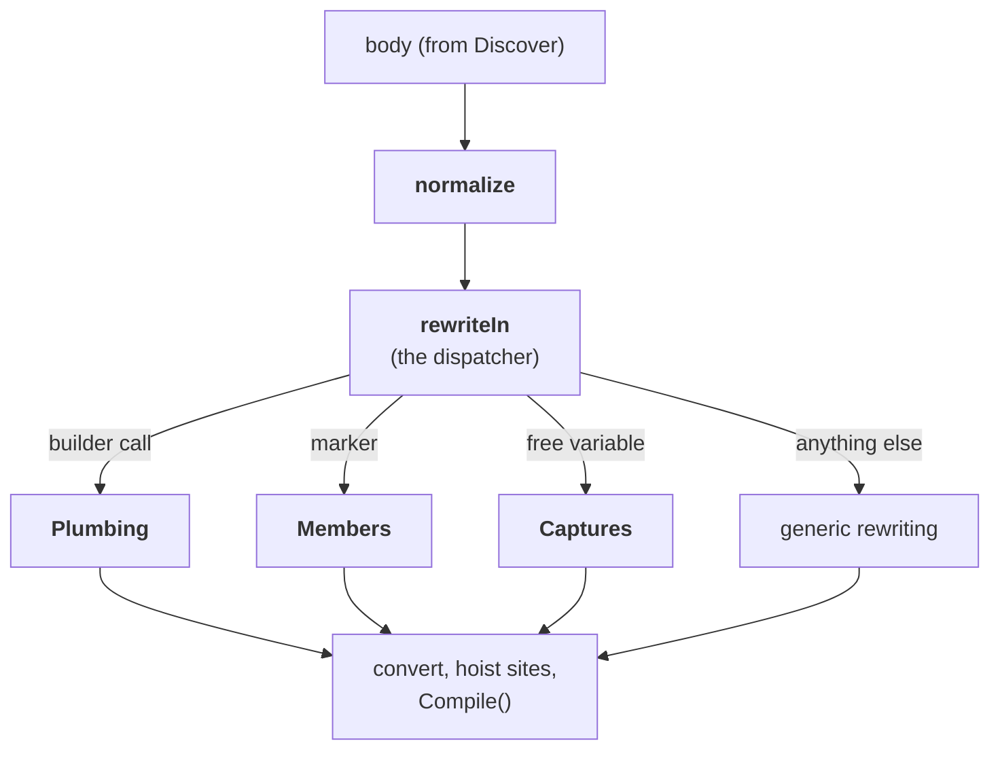

# Translation

How a block's quotation becomes the expression tree, and what it assumes about the compiler.
Part of [internals](internals.md).

## Shape of `Translate.translate`

- **`normalize`**: pipes and curried markers beta-reduced; `let`s of literals and variables
  inlined ([below](#notes)).
- **`rewriteIn`** dispatches each node of the body to one of four sections:
  - **Plumbing** (a call on the builder): `Return` / `Zero` / `Combine` fold away;
    `For` / `While` / `TryWith` / `TryFinally` / `Using` become `DlrRuntime` calls over `Func`
    delegates; a nested `Run` becomes its body.
  - **Members** (a marker operation): a literal name is a baked site ([binders](binders.md)); a
    computed name or run-time type arguments go through a keyed site
    ([call-sites](call-sites.md)); also `compoundAssign`, `new'`, `item`, the operators and `cast`.
  - **Captures** (a free variable): a field of the machine (or closure) by name; an `FSharpRef`
    for a mutable; otherwise the definition the optimizer inlined, from the enclosing member's
    body.
  - **Generic rewriting** (everything else): `let mutable` and `let rec` become ref cells;
    `NewDelegate` and lambdas (made capturing on wasm); any other structure rebuilt as it is.
- **The output**: `NewDelegate(Func<'SM,'T>, [sm], …)`, then `LeafExpressionConverter`, then the
  `SiteHoister`, then rewrapped as `DlrReader<'SM,'T>` over `inref<'SM>` and compiled. On the
  closure path the `Func<obj,'T>` is compiled as it is.

Each section takes the recursive rewriter as a parameter, so the mutual recursion is explicit
rather than one `let rec` group. A `Block` record carries the per-block state: the builder type,
the binder context, the enclosing member's body, the container type and its fields.

The container is the block's compiler-generated state machine struct (see [pipeline](pipeline.md)),
or its Delay closure class on the fallback path. Both carry the captured variables as fields of
the same names, so the translation is one code path over `Block.Self`.

The quotation is converted with the struct as a by-value parameter (a quotation variable cannot
be `byref`). The converted body is then rewrapped as a `DlrReader<'SM, 'T>` taking `inref<'SM>`,
whose first statement copies the machine into that by-value local. A byref cannot be closed over
by the nested delegates (loop and try bodies), and the copy costs nothing measurable, where a
`Func<'SM, 'T>` taking the struct by value measured four times slower.

## Notes

### Normalisation

Normalisation runs first (`TranslatePatterns.normalize`):

- `|>` / `<|` and applications of the curried markers are beta-reduced. A variable or literal
  argument, or one used once and not under a lambda, is substituted; a `unit` one is run first;
  any other is `let`-bound.
- `let`s of literals and immutable variables are inlined.

So `w |> Dlr.get "A"` is the same node as `Dlr.get "A" w` with a literal name.

### Captured variables

Captured variables become reads of the container's fields by name. A `let mutable` is an
`FSharpRef` field, read through `.Value`.

`Captures.fields` skips the machine's own `Data` and `ResumptionPoint`, declared first:
- a captured `Data` has a second field of that name after them;
- an inlined `ResumptionPoint` has none and must not find the machine's, and an `int` one the
  optimizer keeps is a compiler error, as in `task { }`.

When the Release optimizer inlined a value instead of capturing it, its definition is taken from
the enclosing member's reflected body: a `let`, the single application of a once-called local
function, or a lambda applied on the spot. A block in an `inline` function is beyond recovery in
Release (it is expanded into each caller), and the analyzer's `DLR004` refuses it.

### Control flow

The expression converter has no node for `for`, `while`, `try` or `use`. They are emitted as
calls to `DlrRuntime.*` helpers with the bodies as `Func` delegates. Not F# lambdas: on
browser-wasm the `FuncConvert` wrapper the converter would add lost arguments, the same fault
behind the [function ↔ delegate conversions](binders.md#function-and-delegate-conversions).

That holds for a `try`, `while` or `for i in a .. b` anywhere, not only the builder's. Under a
lambda, in a delegate literal, or used as a value (`let n = try … with _ -> 0`), the raw
`TryWith`/`TryFinally`/`WhileLoop`/`ForIntegerRangeLoop` node goes to the same helpers (#158,
#162), and so does a `use` there.

A raw `try`'s handler runs as a delegate, outside any catch block. So the `reraise ()` F# puts
where no case matches throws the caught exception again through `DlrRuntime.rethrow`, its stack
trace kept (`Plumbing.rethrowing`). The builder's handlers have no `reraise ()`: the compiler's
unmatched case there is already a rethrow.

### Mutables and structs

- `let rec` is tied through reference cells, and so is a `let mutable` of the block: loop and
  `try` bodies are compiled into delegates, and a tree variable cannot be assigned from inside
  one.
- A captured mutable already is a cell, so `v <- x` writes its `Value`.
- A struct in a cell (the block's own or a captured one) reads back as a copy. So a field set,
  property setter or method on it, or on a struct field of it (`v.Inner.X <- 3`), runs on a
  temporary that is written back (`inPlace`):
  - its arguments are evaluated first, so one that mutates the variable is not overwritten;
  - the write-back is in a finally, so a member that mutates then throws keeps the mutation
    (`Binders.InPlace`, which the `SiteHoister` makes a TryFinally the converter has no form
    for, #162).
- A struct tuple's element is read as its field: the converter's `TupleGet` rejects a
  `ValueTuple`.

### Delegate literals

A delegate literal (`Action<string>(fun s -> …)`) is kept whole, made capturing on wasm, and
wrapped in `DelegateLiteral<'D>.Over`. Compiled with the block it would be a `DynamicMethod`
delegate whose `.Method` starts with a hidden `Closure` parameter, which a consumer marshalling
by `.Method` refuses ([binders](binders.md#delegate-literals-in-a-block)).

A *parameterless* one (`Func<int>(fun () -> 7)`, `Action(fun () -> …)`) is quoted with no
parameter and a bare body. FSharp.Core takes it apart as the lambda `fun () -> body` but rebuilds
it only from the bare body, so no rewrite could pass it through. `normalize` turns it into
`ParameterlessLiteral<'D, 'R>.Of (fun () -> body)`, which makes the delegate by the literal's own
type (#156).

### Smaller rules

- **Nested blocks** compile into the outer block: at run time their machine (or closure) would
  be created by the compiled tree, not the compiler, and would have no reflected body.
- **`unit` bodies** end with the unit constant, since an F# `unit` call is `void` in IL and the
  converter will not return that.
- **The builder's types** are `ResumableCode<'D, 'R>` (the shape the compiler's state machine
  needs) where the translation yields the plain `'R`. The builder calls fold to values, and the
  one non-builder node typed that way (the default the compiler yields after the rethrow in an
  unmatched `try … with` arm) is retyped to `'R` (`codeType`).
- **Argument positions** are generic-typed, so a `Coerce(_, obj)` there is the user's `x :> obj`
  and means what `box x` means: an `obj` argument, dispatched on the runtime type. A reference
  tuple in argument position is several arguments (bound once, split with `TupleGet`), as in
  F#'s own method calls; a struct tuple is one value.

### Evaluation order

Evaluation order is C#'s: the target, then the arguments left to right, each once. Some forms
hoist something ahead of the site call:

- a `Dlr.named` record's field temporaries;
- a `namedOf` / `argsOf` list;
- a tuple variable split into arguments;
- an impure computed name or run-time type list;
- always, a call with `Dlr.out` / `Dlr.ref`.

There, `sequenced` binds every impure expression to a variable in source order first, so the
hoisted ones take their own place. Plain calls are untouched. A mutable read counts as impure.

## What the compiler is assumed to do

Specified F#:

- the computation-expression desugaring and caller-info arguments;
- `[<ReflectedDefinition>]` (the quotation is taken before inlining, so the block is still
  `Run(Delay(fun () -> …))` in it);
- resumable code and `__stateMachine` (FS-1087);
- `LeafExpressionConverter`, at FSharp.Core ≥ 10.1.201: the first whose converter takes
  `Sequential`, `PropertySet`, `VarSet` and `FieldSet`, and converts a `Let` without a nested
  lambda.

Not specified, and read by `TranslateBlock.Captures` and `Discover`:

- The state machine struct's fields are named after the captured variables (after its own
  `Data` and `ResumptionPoint`), `this` as `this`, `FSharpRef` for mutables.
- The same holds on the Delay closure when the compiler does not build the machine (Debug). That
  closure is held in a field named `delayed` of the resumable-code delegate's target: the
  builder's own `Delay` lambda captures it under that name, read by `Delayed<'T>`. A target of
  another type is taken as the closure itself, and a null target (the applied function-typed
  block) compiles from the closure class, `Sites<'T>.ClosureTypeOf`.
- The struct or closure is nested in the enclosing module type, or in the file's
  `<StartupCode$…>` class for members of types declared in a namespace (hence the assembly-wide
  fallback in `Discover`).
- For generic members, the struct or closure class is generic over the member's type
  parameters, under the same names (`Discover.instantiate` rebuilds the member with the
  container's arguments).
- The Release optimizer inlines constants, once-called local functions and applied lambdas. The
  markers are `NoInlining` so their arguments stay live and are hoisted into the machine.

A change in any of these raises `DlrTranslationException` on the first call at a site; nothing
binds silently wrong. CI builds with the .NET 10 SDK, Debug and Release, on Linux and Windows
(net48 there too), at the FSharp.Core floor and on the latest release, and on browser-wasm.
