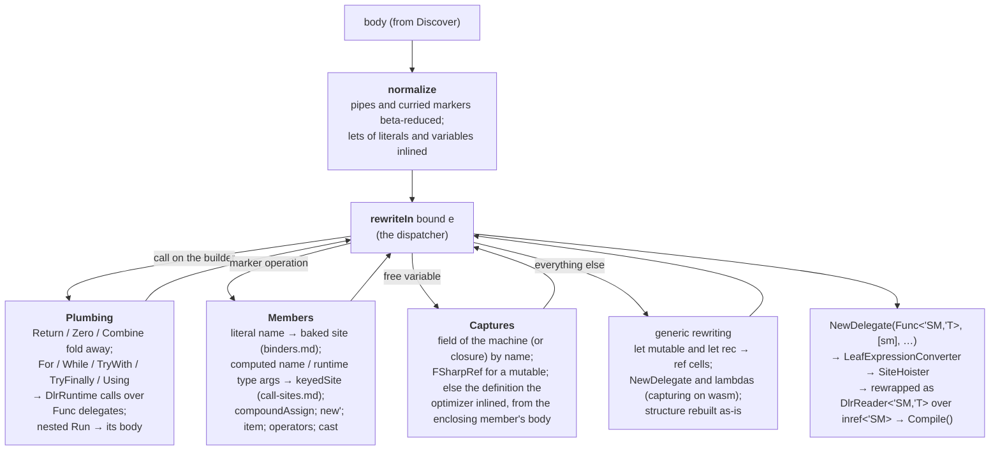

# Translation

How a block's quotation becomes the expression tree, and what it assumes about the compiler.
Part of [internals](internals.md).

## Shape of `Translate.translate`

Each section takes the recursive rewriter as a parameter, so the mutual recursion is explicit
rather than one `let rec` group; a `Block` record carries the per-block state (builder type,
binder context, the enclosing member's body, the container type and its fields).

The container is the block's compiler-generated state machine struct (see [pipeline](pipeline.md)),
or its Delay closure class on the fallback path; both carry the captured variables as fields of
the same names, so the translation is one code path over `Block.Self`. The quotation is
converted with the struct as a by-value parameter (a quotation variable cannot be `byref`); the
converted body is then rewrapped as a `DlrReader<'SM, 'T>` taking `inref<'SM>` whose first
statement copies the machine into that by-value local. A byref cannot be closed over by the
nested delegates (loop and try bodies), and the copy costs nothing measurable, where a
`Func<'SM, 'T>` taking the struct by value measured four times slower.

## Notes

- **Normalisation** first (`Translate.normalize`): `|>` / `<|` and applications of the curried
  markers are beta-reduced (a parameter used once is substituted, otherwise `let`-bound), and
  `let`s of literals and variables are inlined, so `w |> Dlr.get "A"` is the same node as
  `Dlr.get "A" w` with a literal name.
- **Captured variables** become reads of the container's fields by name (`Captures.fields`
  skips the machine's own `Data` and `ResumptionPoint`, declared first: a captured `Data` has a
  second field of that name after them; an inlined `ResumptionPoint` has none and must not find
  the machine's, and an `int` one the optimizer keeps is a compiler error, as in `task { }`); a `let mutable` is an
  `FSharpRef` field, read through `.Value`. When the Release optimizer inlined a value instead of
  capturing it, its definition is taken from the enclosing member's reflected body: a `let`, or
  the single application of a once-called local function.
- **Control flow** the expression converter has no node for (`for`, `while`, `try`, `use`) is
  emitted as calls to `DlrRuntime.*` helpers with the bodies as `Func` delegates (not F#
  lambdas: on browser-wasm the `FuncConvert` wrapper the converter would add lost arguments,
  the same fault behind the [function ↔ delegate conversions](binders.md#functions-and-delegates)).
  `let rec` is tied through reference cells, and so is a `let mutable` of the block: loop and
  `try` bodies are compiled into delegates, and a tree variable cannot be assigned from inside
  one. A captured mutable already is a cell, so `v <- x` writes its `Value`.
- **Nested blocks** compile into the outer block: at run time their machine (or closure) would
  be created by the compiled tree, not the compiler, and would have no reflected body.
- **`unit` bodies** end with the unit constant, since an F# `unit` call is `void` in IL and the
  converter will not return that.
- **The builder's types** are `ResumableCode<'D, 'R>` (the shape the compiler's state machine
  needs) where the translation yields the plain `'R`; the builder calls fold to values, and the
  one non-builder node typed that way — the default the compiler yields after the rethrow in an
  unmatched `try … with` arm — is retyped to `'R` (`codeType`).
- **Argument positions** are generic-typed, so a `Coerce(_, obj)` there is the user's `x :> obj`
  and means what `box x` means: an `obj` argument, dispatched on the runtime type. A reference
  tuple in argument position is several arguments (bound once, split with `TupleGet`), as in F#'s
  own method calls; a struct tuple is one value.

## What the compiler is assumed to do

Specified F#: the computation-expression desugaring, caller-info arguments, `[<ReflectedDefinition>]`
(the quotation is taken before inlining, so the block is still `Run(Delay(fun () -> …))` in it),
resumable code and `__stateMachine` (FS-1087), `LeafExpressionConverter` (FSharp.Core ≥ 10.1:
the first whose converter takes `Sequential`, `PropertySet`, `VarSet` and `FieldSet`, and
converts a `Let` without a nested lambda). Not specified — read by `Translate.Captures` and
`Discover`:

- the state machine struct's fields named after the captured variables (after its own `Data`
  and `ResumptionPoint`), `this` as `this`, `FSharpRef` for mutables; the same on the Delay
  closure when the compiler does not build the machine (Debug), and that closure held in a
  field named `delayed` of the resumable-code delegate's target (the builder's own `Delay`
  lambda captures it under that name; `DlrRun.Closure` falls back to the target itself);
- the struct or closure nested in the enclosing module type, or in the file's `<StartupCode$…>`
  class for members of types declared in a namespace (hence the assembly-wide fallback in
  `Discover`);
- generic members: a struct or closure class generic over the member's type parameters, under
  the same names (`Discover.instantiate` rebuilds the member with the container's arguments);
- the Release optimizer inlining constants and once-called local functions; the markers are
  `NoInlining` so their arguments stay live and are hoisted into the machine.

A change in any of these raises `DlrTranslationException` on the first call at a site; nothing
binds silently wrong. CI builds with the .NET 8, 9 and 10 SDKs in Debug and Release, at the
FSharp.Core floor and on the latest release.
